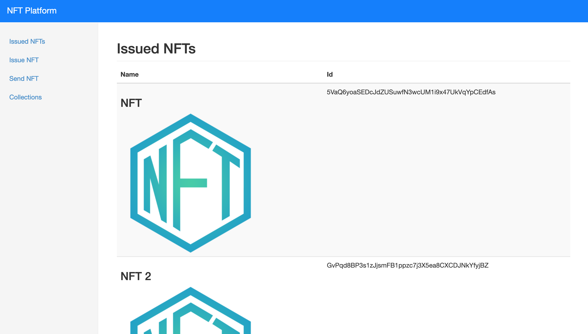
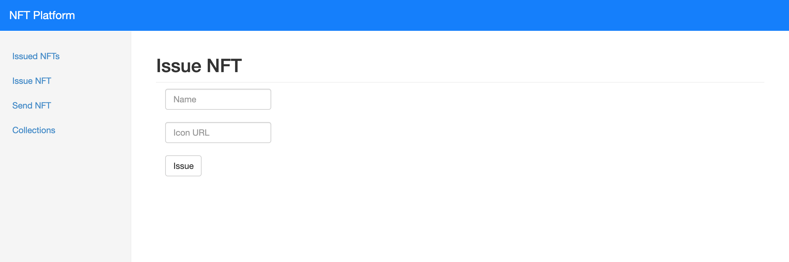
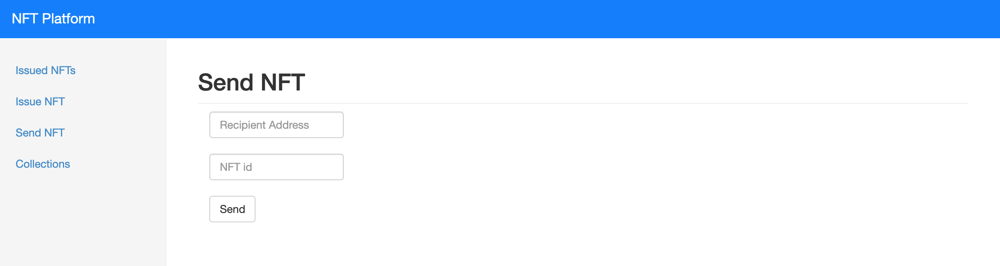
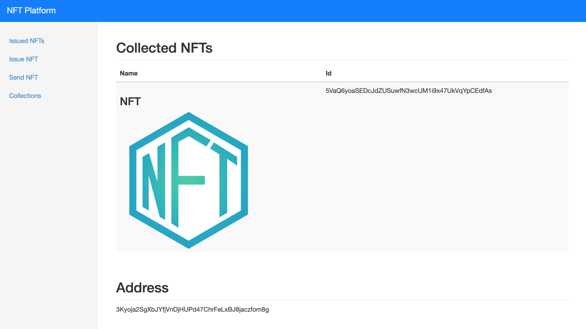
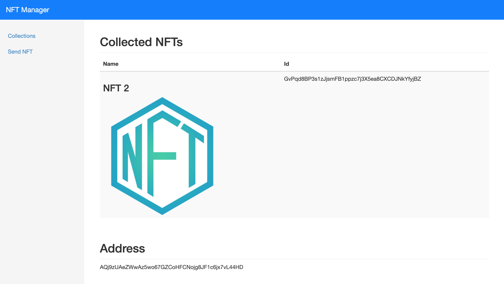
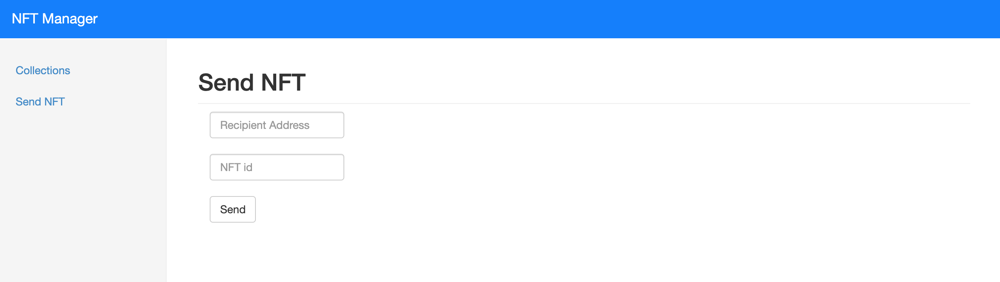

## Solana NFT Platform
Solana NFT Platform allows the Issuer to issue their own NFTs powered by the Solana blockchain. 

Solana NFT Platform consists of two products:-

1. NFT Platform
    * NFT Issuer can use this platform to manage the entire lifecycle of the NFTs.
    * Features include the ability to issue NFT, send NFT, view issued NFTs, view NFT collections etc.
2. NFT Manager
    * NFT owner can use this platform to manage their NFTs.
    * Features include the ability to send NFT, view NFT collections, etc.


## Screenshots

#### NFT Platform








#### NFT Manager





## Getting started

1) Clone Repo
   ```
   git clone https://github.com/viraja1/solana_nft_platform.git 
   ```
   
2) Change directory
   ```
   cd solana_nft_platform
   ```
   
3) Install Docker and Docker Compose

   Docker install: https://docs.docker.com/install/#server
   
   Docker Compose install: https://docs.docker.com/compose/install/
   
4) Build Docker Images    
   ```
   docker-compose -f docker-compose.yml build     
   ```
   
5) Start Docker containers

   Run the below command to launch 2 docker containers named issuer_app and buyer_app. 
   
   ```
   docker-compose -f docker-compose.yml up -d     
   ```
   
6) Check Issuer App (NFT Platform)

   http://localhost:5000
   
7) Check Buyer App (NFT Manager)

   http://localhost:5001
   
8) Airdrop testnet SOL to Issuer and Buyer for testing devnet flow

   ```
   docker exec -it issuer_app bash
   solana airdrop 10
   ```
   
   ```
   docker exec -it buyer_app bash
   solana airdrop 10
   ```
